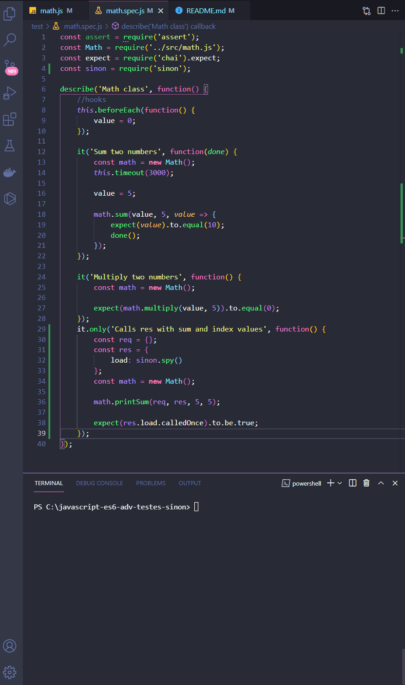

<h1 align="center">
  
   
  JavaScript ES6 - Advanced ES6 Sinon
</h1>

<h3 align="justify">
Didactic demonstration of advanced JavaScripty ES6 tests with sinon. Credits for the Digital Innovation One JavaScript ES6 Advanced module.
</h3>

 

## 📷 Demonstration

<h4 align="left"> sinon </h4>
  
   

 

## 🚀 Technologies

This project was developed with the following technologies:

- JavaScript ES6
- Package.json

 

## ⚙ Settings
- npm i --save-dev sinon
- package.json, "test": "mocha"
- mkdir test
- math.spec.js
- npm run test

 

## ⚙ Sources
- https://www.chaijs.com

 

---

Made with 💜 by Rafael Maciel
